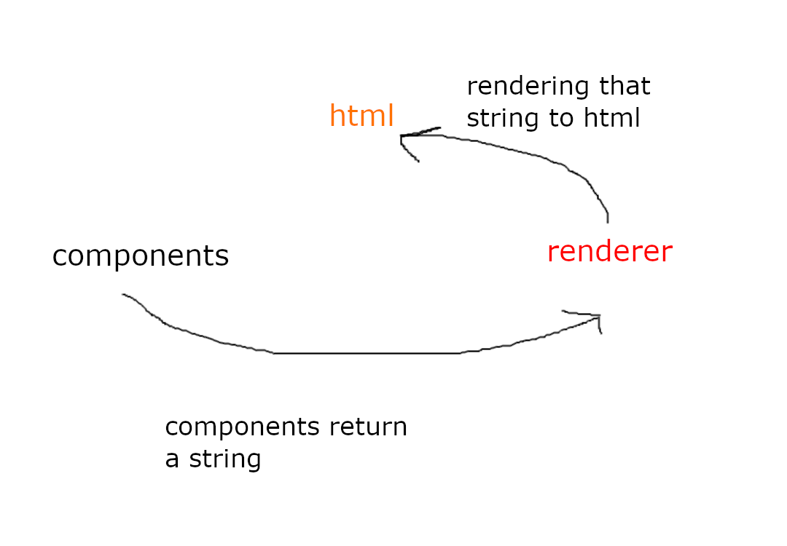

applecake is a javascript library for making HTML elements with javascript really easy .

## Why applecake ?
- Really easy to use
- It is not heavy
- It has a <a href="https://github.com/applecakejs/packer">simple packer</a> to put all of file in to a one file
- It has a <a href="https://github.com/applecakejs/make-applecake-app">template github repository</a> so you don't need to make everything from start

# Installtion
you only need to set up your environment and applecake has a great git repository for it : make-applecake-app
so you can clone it and use <a href="https://github.com/applecakejs/applecake/blob/master/docs/01-Installation/installation.md">Installation guide</a>

## What Is CRH?
C Stand for **Components** , R stand for **Renderer** and H stand for **Html**.
Every Component is a function that returns a string then the renderer (`render.js`) will Render that string to Html file and applecake always use CRH .
maybe this image can help you :
</img>
